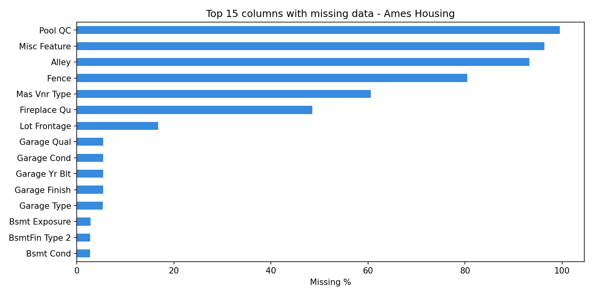
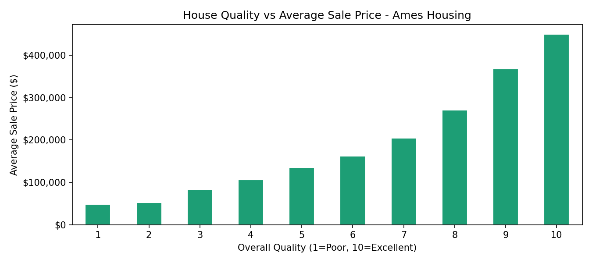
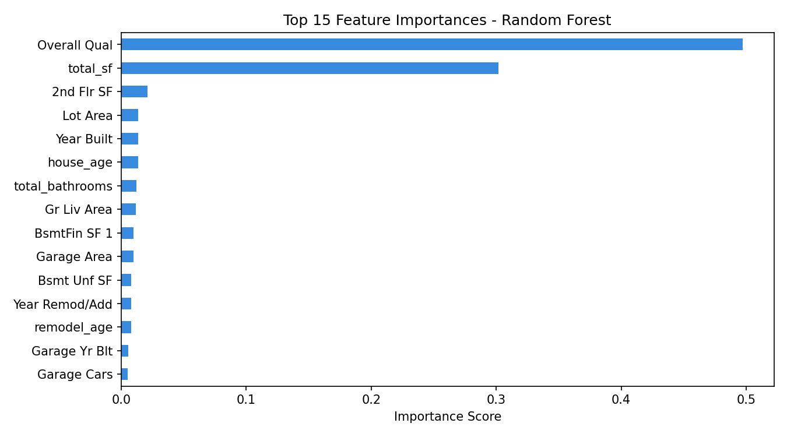
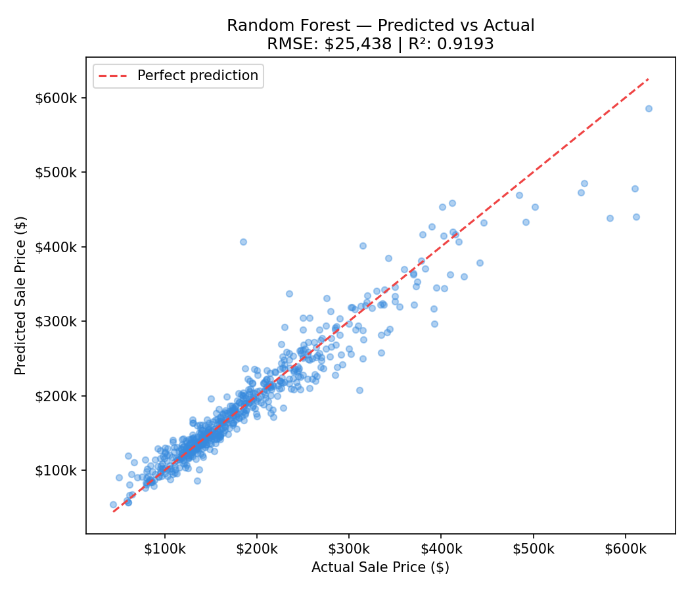

# House Price Prediction — End-to-End ML Pipeline

A production-structured machine learning project predicting residential property sale prices using the Ames Housing dataset (2,930 houses, 80+ raw features).

Built as part of a deliberate ML engineering learning arc — structured like a real project, not a tutorial.

---

## Results

| Model | RMSE | R² |
|---|---|---|
| Baseline (predict mean) | $90,222 | -0.015 |
| Linear Regression | $32,260 | 0.870 |
| Ridge Regression | $32,229 | 0.870 |
| **Random Forest** | **$25,347** | **0.920** |

The Random Forest model explains **92% of variance** in house prices with a mean error of ~$25k across a price range of $50k–$600k+.

---

## Key Finding — Feature Engineering

The single most impactful move in this project was engineering `total_sf` by combining basement, first floor, and second floor square footage into one feature:

```python
df["total_sf"] = df["Total Bsmt SF"] + df["1st Flr SF"] + df["2nd Flr SF"]
```

This engineered feature became the **2nd most important predictor** in the Random Forest (30.1% importance), outperforming every original individual floor area column. `Overall Qual` ranked first at 49.7%.

---

## Project Structure

```
ml-foundation/
├── data/
│   ├── raw/                  # Original Ames Housing CSV — never modified
│   └── processed/            # X_features.csv, y_target.csv — ready for modeling
├── notebooks/
│   ├── 01_numpy_foundation.ipynb       # NumPy — arrays, linear algebra, normalization
│   ├── 02_pandas_house_prices.ipynb    # EDA, missing value audit, feature engineering
│   └── 03_sklearn_house_prices.ipynb   # Pipeline, cross-val, model comparison
├── artifacts/
│   ├── missing_values.png              # Missing data audit chart
│   ├── quality_vs_price.png            # Quality rating vs avg sale price
│   ├── feature_importance.png          # Random Forest feature importances
│   └── predicted_vs_actual.png         # Predicted vs actual scatter plot
├── src/
└── tests/
```

---

## Stack

- **Python 3.12** · **uv** for environment management
- **NumPy 2.4** · **Pandas 3.0** · **scikit-learn 1.8** · **Matplotlib**
- **DuckDB** (for future SQL-based feature queries)

---

## Approach

### 1. Exploratory Data Analysis
- Audited 80 features across 2,930 samples
- Classified missing values into two types: **structural NaN** (no pool = NaN in Pool QC) vs **true missing** (Lot Frontage)
- Computed correlation matrix to identify top numeric predictors before modeling

### 2. Data Cleaning Strategy
| Missing Type | Columns | Strategy |
|---|---|---|
| Structural categorical | Pool QC (98%), Misc Feature (96%), Alley (93%), + 12 more | Fill with `"None"` |
| Structural numeric | Garage Area, Bsmt SF, etc. | Fill with `0` |
| True missing numeric | Lot Frontage | Median imputation |
| True missing categorical | Electrical | Mode imputation |

### 3. Feature Engineering
Created 6 new features from domain reasoning:
- `total_sf` — combined floor area (top-2 predictor)
- `house_age` — years from built to sold
- `remodel_age` — years since last remodel
- `total_bathrooms` — weighted bathroom count (half baths = 0.5)
- `has_garage` — binary flag
- `has_pool` — binary flag

### 4. Encoding
- Quality columns (Ex/Gd/TA/Fa/Po) → ordinal encoded (5/4/3/2/1)
- Unordered categoricals (Neighborhood, House Style, etc.) → one-hot encoded
- Final feature matrix: **2,930 samples × 91 features**

### 5. Modeling
- **sklearn Pipeline** (scaler + model) to prevent data leakage
- **5-fold cross-validation** for reliable evaluation
- Compared Baseline → Linear Regression → Ridge → Random Forest

---

## Artifacts

### Missing Value Audit


### Quality vs Price


### Feature Importance


### Predicted vs Actual


---

## Next Steps
- [ ] Hyperparameter tuning with `GridSearchCV`
- [ ] Try XGBoost and compare against Random Forest
- [ ] Log-transform `SalePrice` to handle right skew
- [ ] Export trained model with `joblib` for serving

---

*Built by [Coach Ayomide](https://www.linkedin.com/in/ayomide-adediran-419138279/) - developer, mentor, and founder based in Ibadan, Nigeria.*
